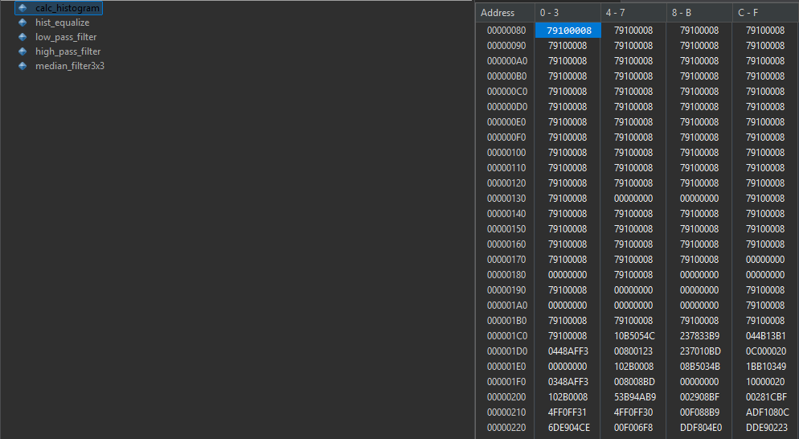
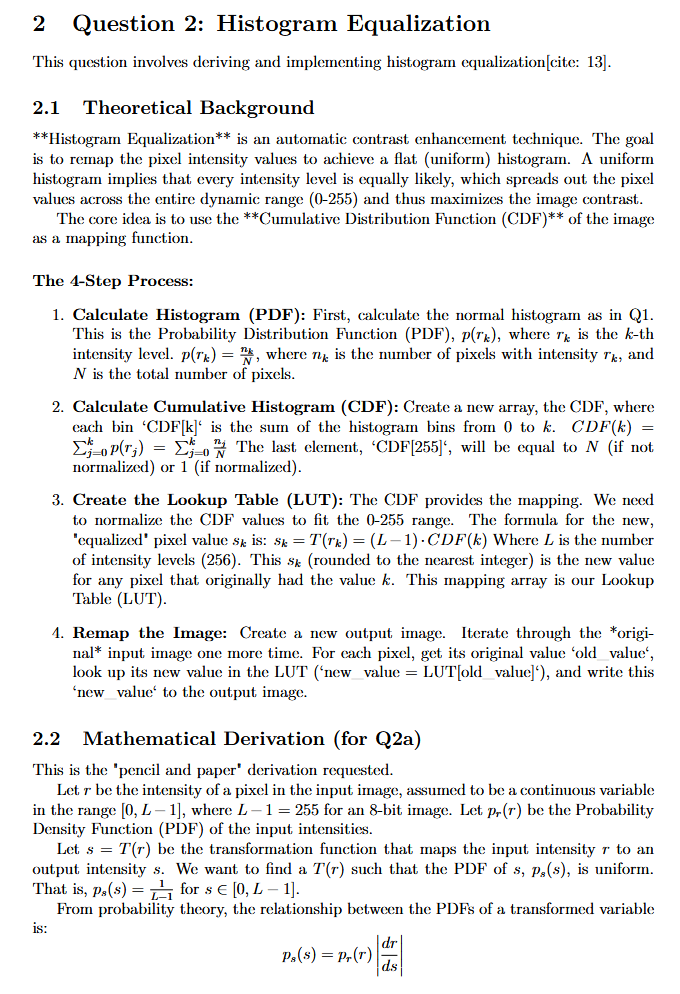
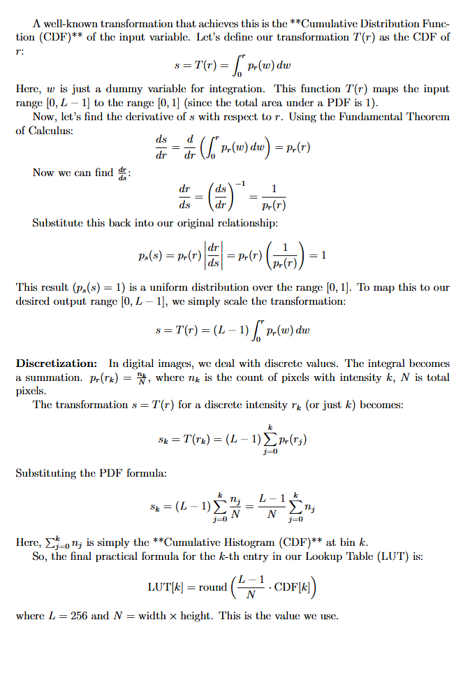
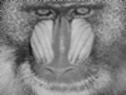
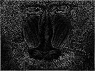
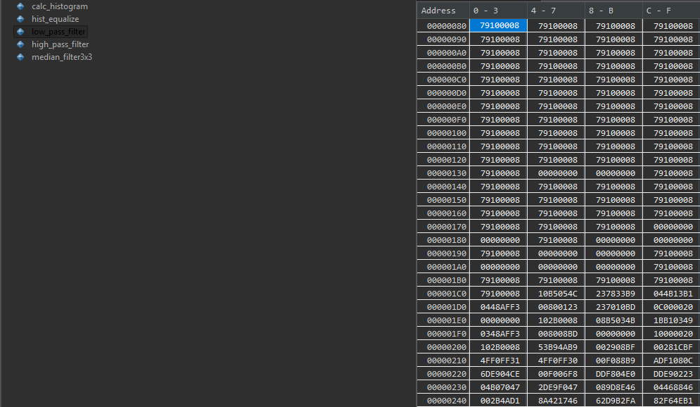
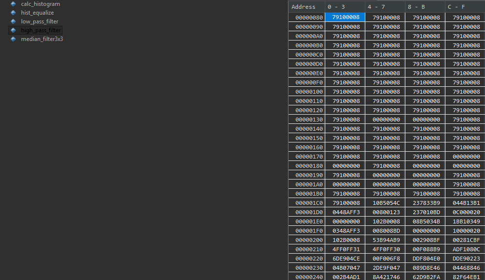
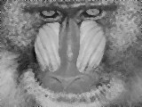
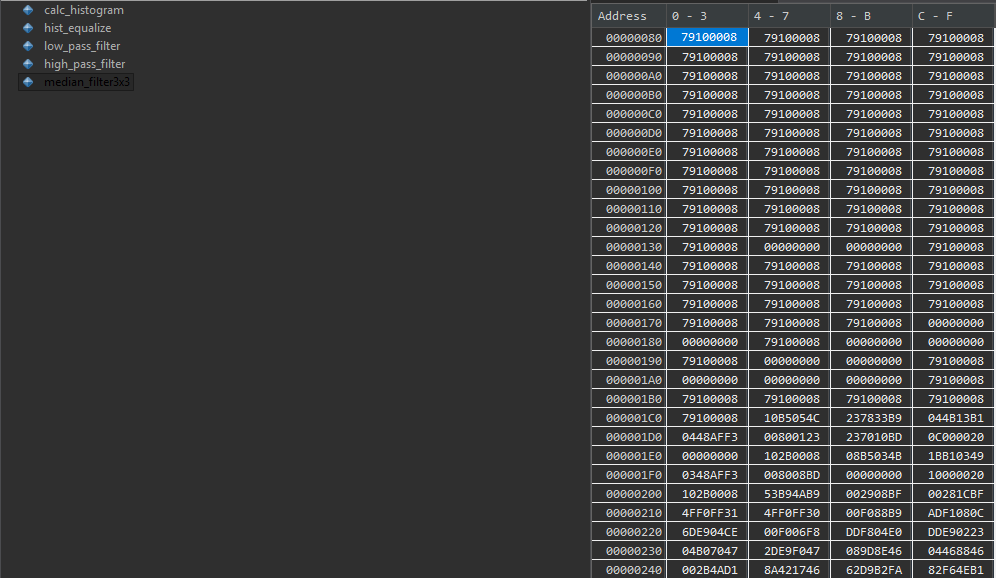

# EE4065 - Embedded Digital Image Processing: Homework 2

## Project Overview
This repository contains the implementation of basic image processing algorithms on an STM32 microcontroller as part of the **EE4065 Embedded Digital Image Processing** course (Homework 2).

The primary goal was to implement histogram calculation, histogram equalization, 2D convolution (Low-pass & High-pass filtering), and median filtering using C on an embedded system and verify the results via STM32CubeIDE Memory Browser and Serial communication.

**Submission Date:** November 21, 2025 

### Team Members
* **Kerem Ergünay**
* **Tarık Erdoğan**

---

## Table of Contents
1.  [Q1: Histogram Formation](#q1-histogram-formation)
2.  [Q2: Histogram Equalization](#q2-histogram-equalization)
3.  [Q3: 2D Convolution and Filtering](#q3-2d-convolution-and-filtering)
    * [Low Pass Filter](#low-pass-filter)
    * [High Pass Filter](#high-pass-filter)
4.  [Q4: Median Filtering](#q4-median-filtering)

---

## Q1: Histogram Formation
**Objective:** Calculate the histogram of a given grayscale image on the microcontroller.

### Implementation Details
A grayscale image was converted into a C header file and imported into the STM32 project. A function iterates through the image array, counting the frequency of each pixel intensity (0-255) and storing it in a histogram array.

### Memory Browser Verification
The calculated histogram values stored in the memory can be seen below:

*(Figure: Memory Browser view of the `hist_orig` array)*

---

## Q2: Histogram Equalization
**Objective:** Derive the histogram equalization method and implement it to improve image contrast.

### A. Mathematical Derivation
The mathematical derivation of the histogram equalization method (Transformation function $s = T(r)$ based on CDF) is provided below as requested.

| Page 1 | Page 2 |
| :---: | :---: |
|  |  |

### B. Implementation & Results
The algorithm calculates the Cumulative Distribution Function (CDF) of the original histogram and maps the pixel values to new values to achieve a uniform histogram distribution.

#### Visual Comparison
| Original Image (`img_in`) | Equalized Image (`img_eq`) |
| :---: | :---: |
|  |  |
*(Note: Images retrieved via Serial Protocol)*

### Memory Browser Verification
The updated histogram entries after equalization:

*(Figure: Memory Browser view of the `hist_eq` array)*

---

## Q3: 2D Convolution and Filtering
**Objective:** Implement a generic 2D convolution function and apply Low Pass and High Pass filters.

### Low Pass Filter
**Kernel Used:** A 3x3 averaging kernel (all elements are 1) with a divisor of 9. This filter blurs the image to reduce noise.

#### Visual Comparison
| Original Image (`img_in`) | Low Pass Filtered (`img_low`) |
| :---: | :---: |
|  |  |

### High Pass Filter
**Kernel Used:** A 3x3 Laplacian-style kernel. This filter emphasizes edges and fine details in the image.

#### Visual Comparison
| Original Image (`img_in`) | High Pass Filtered (`img_high`) |
| :---: | :---: |
|  |  |

### Memory Browser Verification
Below are the memory views for the processed image buffers:

| Low Pass Buffer | High Pass Buffer |
| :---: | :---: |
|  |  |

---

## Q4: Median Filtering
**Objective:** Implement a non-linear median filter to remove "salt and pepper" noise.

### Implementation Details
A 3x3 sliding window moves across the image. For each window, the 9 pixel values are sorted in ascending order, and the median value (the 5th element) replaces the center pixel. This method preserves edges better than the mean filter.

#### Visual Comparison
| Original Image (`img_in`) | Median Filtered (`img_med`) |
| :---: | :---: |
|  |  |

### Memory Browser Verification
The memory content of the median filtered image buffer:

*(Figure: Memory Browser view of the `img_med` array)*

---

## Technical Setup
* **Hardware:** STM32 Nucleo-F446RE (or your specific board)
* **IDE:** STM32CubeIDE
* **Visualization:** Python script using `pyserial` and `opencv` to reconstruct images sent via UART.
