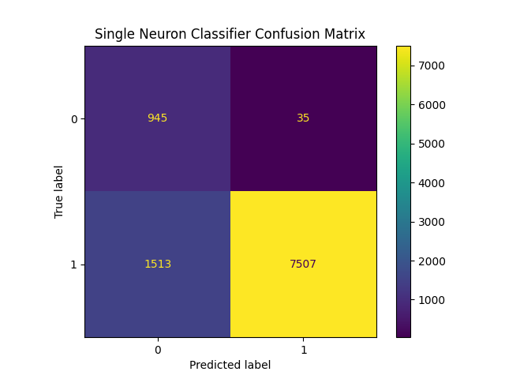
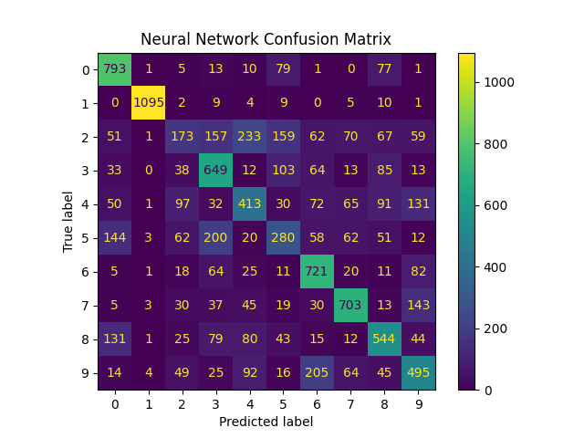

# EE4065 - Embedded Digital Image Processing: Homework 4

## Project Overview
This repository contains the implementation of handwritten digit recognition using machine learning techniques as part of the **EE4065 Embedded Digital Image Processing** course (Homework 4).

The primary goal was to implement digit classification using the MNIST dataset with two different approaches: a Single Neuron (Perceptron) classifier for binary classification and a Multi-Layer Perceptron (MLP) neural network for multi-class classification.

**Reference Book:** C. Ünsalan, B. Höke, and E. Atmaca, *Embedded Machine Learning with Microcontrollers: Applications on STM32 Boards*, Springer Nature, ISBN: 978-3031709111, 2025

**Submission Date:** December 26, 2025

### Team Members
* **Kerem Ergünay**
* **Tarık Erdoğan**

---

## Table of Contents
1.  [Q1: Single Neuron Classifier (Section 10.9)](#q1-single-neuron-classifier-section-109)
2.  [Q2: Multi-Layer Perceptron Classifier (Section 11.8)](#q2-multi-layer-perceptron-classifier-section-118)

---

## Q1: Single Neuron Classifier (Section 10.9)
**Objective:** Implement a single neuron (perceptron) classifier for handwritten digit recognition using Hu Moments as features.

### Feature Extraction: Hu Moments
Hu Moments are a set of 7 values calculated from central moments that are invariant to image transformations (translation, scale, and rotation). For each 28×28 MNIST image, we compute these moments using OpenCV:

```python
train_huMoments = np.empty((len(train_images), 7))
for train_idx, train_img in enumerate(train_images):
    train_moments = cv2.moments(train_img, True)
    train_huMoments[train_idx] = cv2.HuMoments(train_moments).reshape(7)
```

The `cv2.moments()` function calculates the spatial moments up to 3rd order, and `cv2.HuMoments()` derives the 7 Hu invariant moments from these.

### Feature Normalization (Z-Score Standardization)
To ensure stable training, features are normalized using z-score standardization based on training set statistics:

```python
features_mean = np.mean(train_huMoments, axis=0)
features_std = np.std(train_huMoments, axis=0)
train_huMoments = (train_huMoments - features_mean) / features_std
test_huMoments = (test_huMoments - features_mean) / features_std
```

This transforms features to have zero mean and unit variance: $z = \frac{x - \mu}{\sigma}$

### Binary Label Encoding
For binary classification, labels are converted: digit "0" remains 0, all other digits become 1:

```python
train_labels[train_labels != 0] = 1
test_labels[test_labels != 0] = 1
```

### Model Architecture
A single perceptron with sigmoid activation function implementing the logistic regression model:

```python
model = tf.keras.models.Sequential([
    tf.keras.layers.Dense(1, input_shape=[7], activation='sigmoid'),
])

model.compile(
    optimizer=tf.keras.optimizers.Adam(learning_rate=1e-3),
    loss=tf.keras.losses.BinaryCrossentropy(),
    metrics=[tf.keras.metrics.BinaryAccuracy()]
)
```

**Mathematical Representation:**
$$\hat{y} = \sigma\left(\sum_{i=1}^{7} w_i \cdot x_i + b\right) = \frac{1}{1 + e^{-(\mathbf{w}^T\mathbf{x} + b)}}$$

where $\sigma$ is the sigmoid activation function.

### Training Configuration
```python
model.fit(
    train_huMoments, train_labels,
    batch_size=128,
    epochs=50,
    class_weight={0: 8, 1: 1},  # Handle class imbalance (10% zeros vs 90% non-zeros)
    verbose=1
)
```

- **Class Weights:** Since digit "0" represents only ~10% of the dataset, we apply class weighting to prevent the model from simply predicting the majority class.

### Results
The confusion matrix shows the classification performance on the test set (10,000 images):


*(Figure: Confusion matrix for the Single Neuron Classifier - Binary classification: "0" vs "non-0")*

### Prediction & Evaluation
```python
perceptron_preds = model.predict(test_huMoments)
conf_matrix = confusion_matrix(test_labels, perceptron_preds > 0.5)
```

The decision threshold is set at 0.5: predictions above this value are classified as "non-0" (class 1).

---

## Q2: Multi-Layer Perceptron Classifier (Section 11.8)
**Objective:** Implement a Multi-Layer Perceptron (MLP) neural network for multi-class handwritten digit recognition (0-9).

### Feature Extraction
Same Hu Moments extraction as Q1 - 7 rotation, scale, and translation invariant features per image.

### Model Architecture
A 3-layer fully-connected neural network with ReLU activations and Softmax output:

```python
model = keras.models.Sequential([
    keras.layers.Dense(100, input_shape=[7], activation="relu"),
    keras.layers.Dense(100, activation="relu"),
    keras.layers.Dense(10, activation="softmax")
])
```

**Network Structure:**
| Layer | Neurons | Activation | Parameters |
|-------|---------|------------|------------|
| Input | 7 | - | - |
| Hidden 1 | 100 | ReLU | 7×100 + 100 = 800 |
| Hidden 2 | 100 | ReLU | 100×100 + 100 = 10,100 |
| Output | 10 | Softmax | 100×10 + 10 = 1,010 |
| **Total** | - | - | **11,910** |

**ReLU Activation:** $f(x) = \max(0, x)$

**Softmax Output:** $\text{softmax}(z_i) = \frac{e^{z_i}}{\sum_{j=1}^{10} e^{z_j}}$

### Training Configuration
```python
model.compile(
    loss=keras.losses.SparseCategoricalCrossentropy(),
    optimizer=keras.optimizers.Adam(1e-4)
)

mc_callback = ModelCheckpoint("mlp_mnist_model.h5")
es_callback = EarlyStopping("loss", patience=5)

model.fit(
    train_huMoments, train_labels,
    epochs=1000,
    verbose=1,
    callbacks=[mc_callback, es_callback]
)
```

**Callbacks:**
- `ModelCheckpoint`: Saves model weights after each epoch
- `EarlyStopping`: Terminates training if loss doesn't improve for 5 consecutive epochs (prevents overfitting)

**Loss Function:** Sparse Categorical Cross-Entropy
$$\mathcal{L} = -\sum_{i=1}^{N} \log(p_{y_i})$$
where $p_{y_i}$ is the predicted probability for the true class.

### Results
The confusion matrix shows the classification performance across all 10 digit classes:


*(Figure: Confusion matrix for the MLP Classifier - Multi-class classification: digits 0-9)*

### Prediction & Evaluation
```python
nn_preds = model.predict(test_huMoments)
predicted_classes = np.argmax(nn_preds, axis=1)
conf_matrix = confusion_matrix(test_labels, predicted_classes)
```

The `argmax` function selects the class with the highest probability from the softmax output.

---

## Dataset

### MNIST Handwritten Digits
| Property | Value |
|----------|-------|
| Training Samples | 60,000 |
| Test Samples | 10,000 |
| Image Dimensions | 28 × 28 pixels |
| Color Depth | 8-bit Grayscale (0-255) |
| Classes | 10 (digits 0-9) |

### IDX File Format Parser
Custom loader implementation for reading MNIST's IDX binary format:

```python
def load_images(path):
    with open(path, 'rb') as f:
        magic = struct.unpack('>I', f.read(4))[0]  # Big-endian 32-bit integer
        num_images = struct.unpack('>I', f.read(4))[0]
        rows = struct.unpack('>I', f.read(4))[0]
        cols = struct.unpack('>I', f.read(4))[0]
        data = np.frombuffer(f.read(), dtype=np.uint8)
        return data.reshape(num_images, rows, cols)
```

The IDX format uses big-endian byte order with magic numbers: `2051` for images, `2049` for labels.

---

## Technical Setup

### Dependencies
| Library | Version | Purpose |
|---------|---------|---------|
| Python | 3.10 | Runtime environment |
| TensorFlow | 2.10 | Neural network framework |
| Keras | 2.10 | High-level neural network API |
| NumPy | 1.26.x | Numerical array operations |
| OpenCV | 4.9.x | Image processing & Hu Moments |
| Scikit-learn | 1.4.x | Confusion matrix utilities |
| Matplotlib | 3.8.x | Visualization |

### Execution
```bash
# Navigate to the project directory
cd HW_4

# Run Q1 - Single Neuron Classifier (Binary: 0 vs non-0)
python 10-9.py

# Run Q2 - MLP Classifier (Multi-class: 0-9)
python 11-8.py
```

### Output Models
- `mnist_single_neuron.h5` - Trained single neuron model weights
- `mlp_mnist_model.h5` - Trained MLP model weights
