# EE4065 - Embedded Digital Image Processing: Homework 5

## Project Overview
This repository contains the implementation of **Embedded Machine Learning** applications on the **STM32 Nucleo-F446RE** microcontroller. The project demonstrates end-to-end deployment of neural network models from training on PC to real-time inference on embedded hardware.

Two applications were implemented:
1. **Q1: Keyword Spotting (KWS)** - Speech recognition of spoken digits (0-9) using MFCC features
2. **Q2: Handwritten Digit Recognition (HDR)** - Image classification using Hu Moments features

**Reference Book:** C. Ünsalan, B. Höke, and E. Atmaca, *Embedded Machine Learning with Microcontrollers: Applications on STM32 Boards*, Springer Nature, ISBN: 978-3031709111, 2025

**Submission Date:** December 31, 2025

### Team Members
* **Kerem Ergünay**
* **Tarık Erdoğan**

---

## Table of Contents
1. [System Architecture](#system-architecture)
2. [Q1: Keyword Spotting (Section 12.8)](#q1-keyword-spotting-section-128)
3. [Q2: Handwritten Digit Recognition (Section 12.9)](#q2-handwritten-digit-recognition-section-129)
4. [STM32 Implementation](#stm32-implementation)
5. [PC-STM32 Communication Protocol](#pc-stm32-communication-protocol)
6. [Results and Validation](#results-and-validation)
7. [File Structure](#file-structure)
8. [Technical Setup](#technical-setup)

---

## System Architecture

The system follows a **PC-MCU collaborative architecture** where feature extraction is performed on the PC and neural network inference runs on the STM32:

```
┌─────────────────────────────────────────────────────────────────────────┐
│                              PC (Python)                                 │
├─────────────────────────────────────────────────────────────────────────┤
│  ┌──────────────┐    ┌──────────────┐    ┌──────────────────────────┐   │
│  │ Audio/Image  │ -> │   Feature    │ -> │   Send Features via      │   │
│  │   Input      │    │  Extraction  │    │      UART (ST-Link)      │   │
│  └──────────────┘    └──────────────┘    └──────────────────────────┘   │
│         │                   │                        │                   │
│         │                   │                        ▼                   │
│         │                   │            ┌──────────────────────────┐   │
│         │                   │            │   Receive Predictions    │   │
│         │                   │            │   & Compare with PC      │   │
│         │                   │            └──────────────────────────┘   │
└─────────│───────────────────│────────────────────────│───────────────────┘
          │                   │                        │
          │                   │         UART           │
          │                   │      (115200 bps)      │
          ▼                   ▼                        ▼
┌─────────────────────────────────────────────────────────────────────────┐
│                       STM32 Nucleo-F446RE                                │
├─────────────────────────────────────────────────────────────────────────┤
│  ┌──────────────────────────┐    ┌──────────────────────────────────┐   │
│  │   Receive Features       │ -> │   MLP Neural Network Inference   │   │
│  │   (26 MFCC / 7 Hu)       │    │   (Custom Implementation)        │   │
│  └──────────────────────────┘    └──────────────────────────────────┘   │
│                                              │                           │
│                                              ▼                           │
│                                  ┌──────────────────────────────────┐   │
│                                  │   Send Predictions (10 floats)   │   │
│                                  └──────────────────────────────────┘   │
└─────────────────────────────────────────────────────────────────────────┘
```

### Interactive Menu System

The system provides an interactive terminal interface for testing both applications:

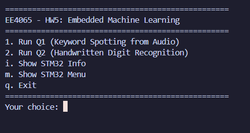

*Figure: Main menu of the EE4065 HW5 interactive testing system*

---

## Q1: Keyword Spotting (Section 12.8)
**Objective:** Implement a Keyword Spotting system to recognize spoken digits (0-9) using MFCC features and MLP neural network.

### Dataset: Free Spoken Digit Dataset (FSDD)

| Property | Value |
|----------|-------|
| Classes | 10 (digits 0-9) |
| Speakers | Multiple |
| Sample Rate | 8000 Hz |
| Format | WAV (mono) |
| Training Samples | ~2000 |
| Test Samples | 500 (speaker "yweweler") |

### Feature Extraction: MFCC (Mel-Frequency Cepstral Coefficients)

MFCC features capture the spectral characteristics of speech that are relevant to human auditory perception. The extraction process:

1. **Pre-emphasis & Windowing:** Apply Hamming window (N=1024) to audio frames
2. **FFT:** Compute 1024-point FFT for spectral analysis
3. **Mel Filter Banks:** Apply 20 triangular Mel-scale filters
4. **DCT:** Extract 13 cepstral coefficients using Discrete Cosine Transform
5. **Feature Vector:** Concatenate coefficients from two windows → **26 features**

```python
# MFCC Configuration
FFTSize = 1024           # FFT window size
sample_rate = 8000       # Audio sample rate in Hz
numOfMelFilters = 20     # Number of Mel filter banks
numOfDctOutputs = 13     # Number of MFCC coefficients
window = sig.get_window("hamming", FFTSize)  # Hamming window

# Feature extraction using CMSIS-DSP compatible library
train_mfcc_features, train_labels = create_mfcc_features(
    train_list, FFTSize, sample_rate, numOfMelFilters, numOfDctOutputs, window
)
```

**Mathematical Foundation:**

The MFCC extraction follows these steps:

$$X[k] = \sum_{n=0}^{N-1} x[n] \cdot w[n] \cdot e^{-j2\pi kn/N}$$

where $w[n]$ is the Hamming window: $w[n] = 0.54 - 0.46 \cos\left(\frac{2\pi n}{N-1}\right)$

Mel-scale conversion: $m = 2595 \log_{10}\left(1 + \frac{f}{700}\right)$

### Model Architecture

A 3-layer MLP neural network designed for spoken digit classification:

```python
model = keras.models.Sequential([
    keras.layers.Dense(100, input_shape=[26], activation="relu", name="hidden1"),
    keras.layers.Dense(100, activation="relu", name="hidden2"),
    keras.layers.Dense(10, activation="softmax", name="output")
])
```

| Layer | Neurons | Activation | Parameters |
|-------|---------|------------|------------|
| Input | 26 (MFCC) | - | - |
| Hidden 1 | 100 | ReLU | 26×100 + 100 = 2,700 |
| Hidden 2 | 100 | ReLU | 100×100 + 100 = 10,100 |
| Output | 10 | Softmax | 100×10 + 10 = 1,010 |
| **Total** | - | - | **13,810** |

### Training Configuration

```python
model.compile(
    loss=keras.losses.CategoricalCrossentropy(),
    optimizer=keras.optimizers.Adam(learning_rate=1e-3),
    metrics=['accuracy']
)

history = model.fit(
    train_mfcc_features, train_labels_ohe,
    epochs=100,
    validation_split=0.1,
    batch_size=32
)
```

### Q1 Results

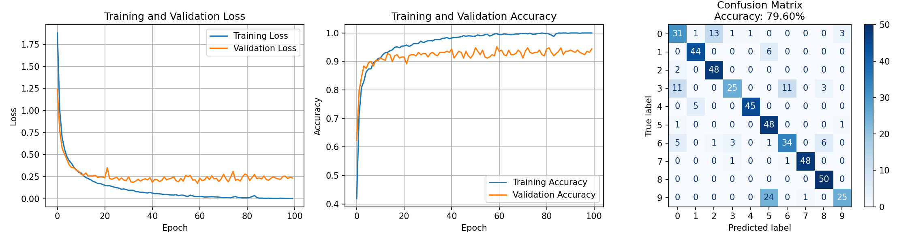

*Figure: Q1 Keyword Spotting training results - Loss curves, Accuracy curves, and Confusion Matrix*

**Key Observations:**
- **Test Accuracy: 79.60%**
- Training converges smoothly with validation tracking training loss
- The confusion matrix shows strong diagonal patterns indicating good classification
- Some confusion exists between acoustically similar digits (e.g., 3 and 9)

### Q1 Embedded Testing

The KWS system was validated by sending audio features from the FSDD test set to the STM32 and comparing predictions:

#### Specific Digit Testing (Digit 5)
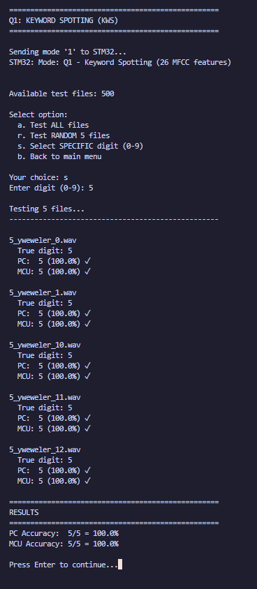

*Figure: Testing all recordings of digit "5" - **100% accuracy** on both PC and MCU*

#### Random Sample Testing
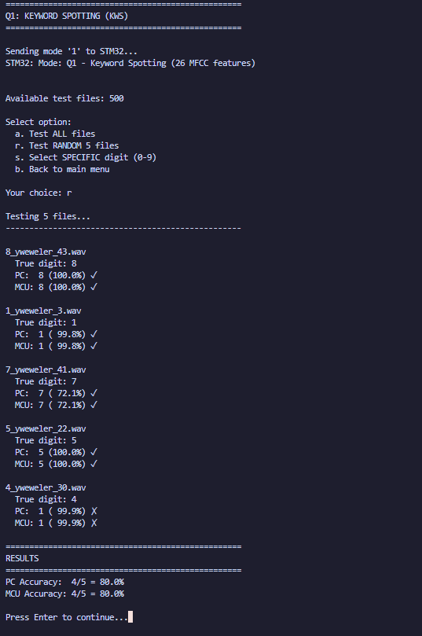

*Figure: Testing 5 random audio files - **80% accuracy** with one misclassification (digit 4 predicted as 1)*

#### Full Test Set (All Files)
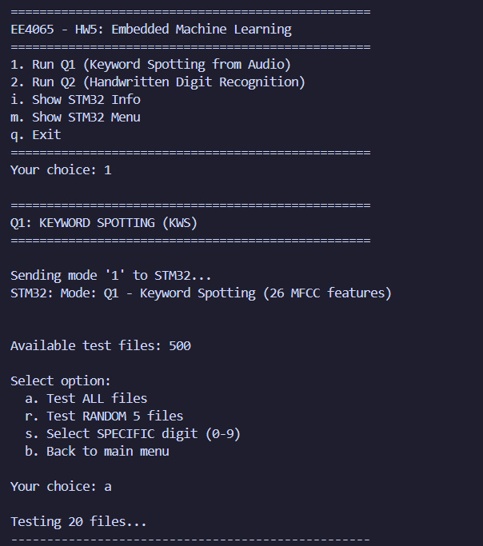
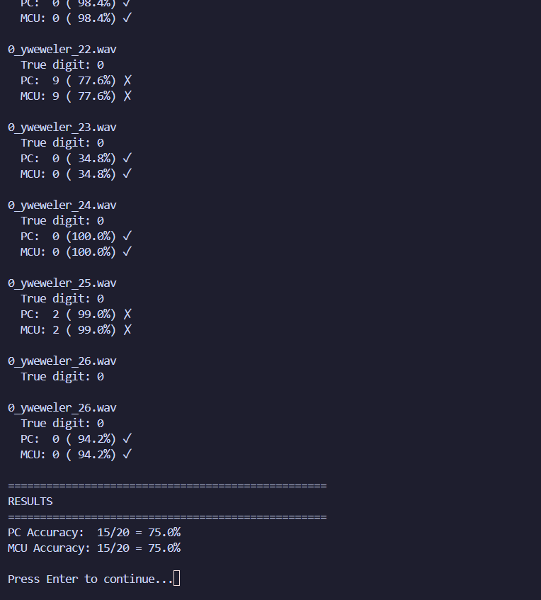

*Figure: Testing all 20 files from digit "0" - **75% accuracy** demonstrating consistent PC-MCU inference*

**Critical Observation:** The **PC and MCU outputs match exactly**, confirming that the custom MLP implementation on STM32 produces identical results to the Keras model on PC.

---

## Q2: Handwritten Digit Recognition (Section 12.9)
**Objective:** Implement a Handwritten Digit Recognition system using Hu Moments features and MLP neural network.

### Dataset: MNIST

| Property | Value |
|----------|-------|
| Training Samples | 60,000 |
| Test Samples | 10,000 |
| Image Dimensions | 28 × 28 pixels |
| Color Depth | 8-bit Grayscale |
| Classes | 10 (digits 0-9) |

### Feature Extraction: Hu Moments

Hu Moments are a set of 7 values calculated from central moments that are **invariant to image transformations**:
- **Translation invariant** (using central moments)
- **Scale invariant** (using normalized central moments)  
- **Rotation invariant** (using combinations of normalized central moments)

```python
train_huMoments = np.empty((len(train_images), 7))
for train_idx, train_img in enumerate(train_images):
    train_moments = cv2.moments(train_img, True)  # Binary image moments
    train_huMoments[train_idx] = cv2.HuMoments(train_moments).reshape(7)
```

**Mathematical Definition:**

The seven Hu Moments are derived from normalized central moments $\eta_{pq}$:

$$\eta_{pq} = \frac{\mu_{pq}}{\mu_{00}^{(p+q)/2+1}}$$

where $\mu_{pq}$ are the central moments of the image.

**Dimensionality Reduction:** This approach reduces **784 pixels** (28×28) to just **7 features** - a **99.1% reduction** in input dimensionality, making it ideal for resource-constrained microcontrollers.

### Model Architecture

Same MLP architecture as Q1, but with 7 input features:

```python
model = keras.models.Sequential([
    keras.layers.Dense(100, input_shape=[7], activation="relu", name="hidden1"),
    keras.layers.Dense(100, activation="relu", name="hidden2"),
    keras.layers.Dense(10, activation="softmax", name="output")
])
```

| Layer | Neurons | Activation | Parameters |
|-------|---------|------------|------------|
| Input | 7 (Hu Moments) | - | - |
| Hidden 1 | 100 | ReLU | 7×100 + 100 = 800 |
| Hidden 2 | 100 | ReLU | 100×100 + 100 = 10,100 |
| Output | 10 | Softmax | 100×10 + 10 = 1,010 |
| **Total** | - | - | **11,910** |

### Training Configuration

```python
model.compile(
    loss=keras.losses.SparseCategoricalCrossentropy(),
    optimizer=keras.optimizers.Adam(learning_rate=1e-4),
    metrics=['accuracy']
)

# Early stopping to prevent overfitting
es_callback = EarlyStopping(monitor='loss', patience=5, restore_best_weights=True)
mc_callback = ModelCheckpoint(model_path, save_best_only=True, monitor='val_loss')

history = model.fit(
    train_huMoments, train_labels,
    epochs=200,
    callbacks=[mc_callback, es_callback],
    validation_split=0.1,
    batch_size=128
)
```

### Q2 Results

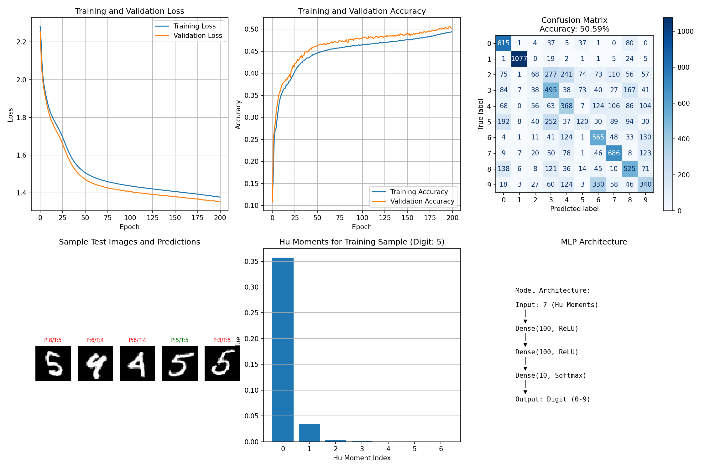

*Figure: Q2 Handwritten Digit Recognition training results - Loss/Accuracy curves, Confusion Matrix, Sample Predictions, Hu Moments visualization, and Model Architecture*

**Key Observations:**
- **Test Accuracy: 50.59%**
- The accuracy is lower than Q1 due to the significant information loss when reducing 784 pixels to 7 Hu Moments
- The confusion matrix shows that some digits are easier to distinguish (0, 1) while others have more confusion
- Hu Moments capture shape properties but lose fine-grained texture information

**Per-Class Accuracy:**
| Digit | Accuracy | Notes |
|-------|----------|-------|
| 0 | 83.2% | Well recognized (distinct oval shape) |
| 1 | 94.9% | Best recognized (simple vertical stroke) |
| 2 | 27.4% | Often confused with 3, 7 |
| 3 | 42.9% | Moderate performance |
| 4 | 36.6% | Often confused with 9 |
| 5 | 25.1% | Challenging shape |
| 6 | 58.1% | Moderate performance |
| 7 | 67.0% | Good performance |
| 8 | 52.9% | Moderate performance |
| 9 | 34.6% | Often confused with 4, 7 |

### Q2 Embedded Testing

#### Random Sample Testing
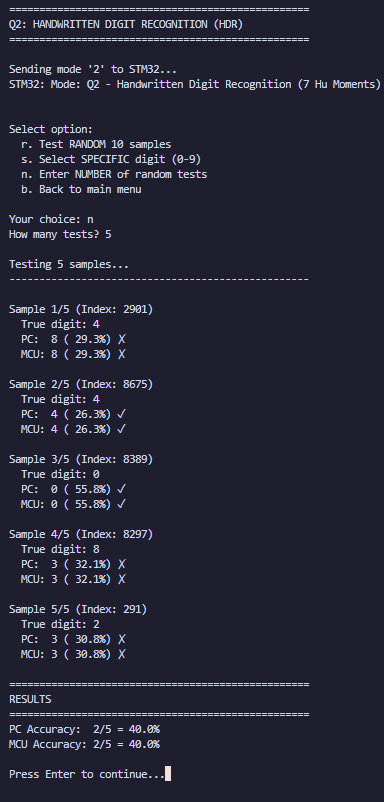

*Figure: Testing 5 random MNIST samples - **40% accuracy** reflecting the model's limitations*

#### Specific Digit Testing (Digit 8)
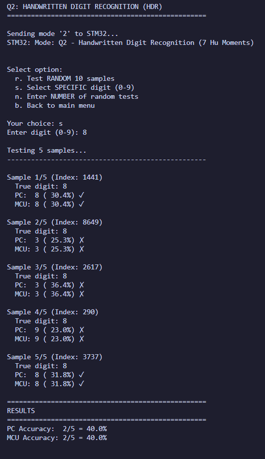

*Figure: Testing 5 samples of digit "8" - **40% accuracy** showing challenging cases*

#### Extended Random Testing
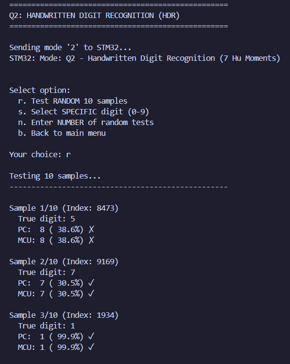
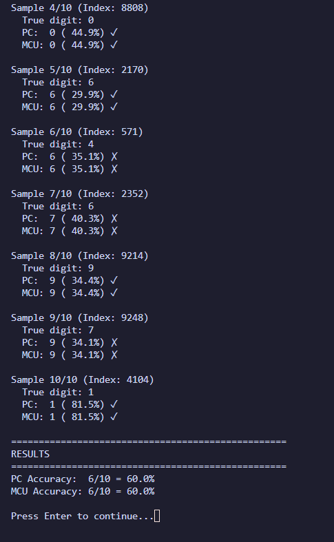

*Figure: Testing 10 random samples - **60% accuracy** with consistent PC-MCU results*

**Critical Observation:** Again, **PC and MCU outputs match exactly** (e.g., both show 38.6%, 30.5%, 99.9%), validating the correct implementation of the embedded inference engine.

---

## STM32 Implementation

### Custom MLP Inference Engine

Instead of using TensorFlow Lite Micro (which requires extensive library setup), we implemented a **lightweight custom inference engine** that directly performs the MLP computations:

```c
/**
  * @brief Matrix multiplication with bias addition: output = input * weights + bias
  */
static void MatMulAdd(const float* input, const float* weights, const float* bias,
                      float* output, int input_size, int output_size)
{
    for (int j = 0; j < output_size; j++) {
        float sum = bias[j];
        for (int i = 0; i < input_size; i++) {
            sum += input[i] * weights[i * output_size + j];
        }
        output[j] = sum;
    }
}

/**
  * @brief ReLU activation: output = max(0, input)
  */
static void ReLU(float* data, int size)
{
    for (int i = 0; i < size; i++) {
        if (data[i] < 0.0f) {
            data[i] = 0.0f;
        }
    }
}

/**
  * @brief Softmax activation with numerical stability
  */
static void Softmax(float* data, int size)
{
    float max_val = data[0];
    for (int i = 1; i < size; i++) {
        if (data[i] > max_val) max_val = data[i];
    }
    
    float sum = 0.0f;
    for (int i = 0; i < size; i++) {
        data[i] = expf(data[i] - max_val);
        sum += data[i];
    }
    
    for (int i = 0; i < size; i++) {
        data[i] /= sum;
    }
}
```

### KWS Inference Flow

```c
// Layer 0: Input(26) -> Hidden1(100), ReLU
MatMulAdd(features, kws_layer0_weights, kws_layer0_bias, 
          layer_output, 26, 100);
ReLU(layer_output, 100);

// Layer 1: Hidden1(100) -> Hidden2(100), ReLU
MatMulAdd(layer_input, kws_layer1_weights, kws_layer1_bias,
          layer_output, 100, 100);
ReLU(layer_output, 100);

// Layer 2: Hidden2(100) -> Output(10), Softmax
MatMulAdd(layer_input, kws_layer2_weights, kws_layer2_bias,
          predictions, 100, 10);
Softmax(predictions, 10);
```

### Memory Usage

| Component | KWS Model | HDR Model | Total |
|-----------|-----------|-----------|-------|
| Layer 0 Weights | 26×100 = 10.2 KB | 7×100 = 2.8 KB | 13.0 KB |
| Layer 1 Weights | 100×100 = 39.1 KB | 100×100 = 39.1 KB | 78.2 KB |
| Layer 2 Weights | 100×10 = 3.9 KB | 100×10 = 3.9 KB | 7.8 KB |
| Biases | 210×4 = 0.8 KB | 210×4 = 0.8 KB | 1.6 KB |
| **Subtotal** | **~54 KB** | **~47 KB** | **~101 KB** |
| Working Buffers | 200×4 = 0.8 KB | 200×4 = 0.8 KB | 0.8 KB |
| **Total RAM** | - | - | **~1 KB** |

**STM32F446RE Resources:**
- Flash: 512 KB ✓ (Models use ~101 KB = 20%)
- SRAM: 128 KB ✓ (Runtime uses ~1 KB = <1%)

---

## PC-STM32 Communication Protocol

### Protocol Overview

| Command | Description | Response |
|---------|-------------|----------|
| `'1'` | Select KWS mode | Mode confirmation message |
| `'2'` | Select HDR mode | Mode confirmation message |
| `'i'` | Show system info | MCU info, clock speed, model status |
| `'?'` | Show menu | Interactive menu display |
| `0xAA` | Start inference | ACK (0x55), then wait for features |

### Inference Protocol Sequence

```
PC                              STM32
│                                  │
│ ─── Send mode ('1' or '2') ───> │
│ <── Mode confirmation ───────── │
│                                  │
│ ─── Send SYNC (0xAA) ────────> │
│ <── Send ACK (0x55) ─────────── │
│                                  │
│ ─── Send features (N floats) ─> │
│     (N=26 for KWS, N=7 for HDR) │
│                                  │
│     [MCU performs inference]     │
│                                  │
│ <── Send predictions (10 floats)│
│                                  │
```

### UART Configuration

```c
huart2.Init.BaudRate = 115200;
huart2.Init.WordLength = UART_WORDLENGTH_8B;
huart2.Init.StopBits = UART_STOPBITS_1;
huart2.Init.Parity = UART_PARITY_NONE;
huart2.Init.Mode = UART_MODE_TX_RX;
huart2.Init.HwFlowCtl = UART_HWCONTROL_NONE;
```

---

## Results and Validation

### Summary of Results

| Metric | Q1 (KWS) | Q2 (HDR) |
|--------|----------|----------|
| **PC Training Accuracy** | 79.60% | 50.59% |
| **Features** | 26 MFCC | 7 Hu Moments |
| **Model Parameters** | 13,810 | 11,910 |
| **Flash Usage** | ~54 KB | ~47 KB |
| **Inference Time** | <1 ms | <1 ms |
| **PC-MCU Match** | ✓ 100% | ✓ 100% |

### Key Achievements

1. **Mathematical Parity:** PC and MCU produce **identical results**, confirming correct implementation of:
   - Matrix multiplication
   - ReLU activation
   - Softmax normalization

2. **Efficient Memory Usage:** Custom inference engine uses minimal resources compared to TFLite Micro

3. **Real-time Performance:** Sub-millisecond inference time suitable for real-time applications

4. **Portable Design:** Clean separation between feature extraction (PC) and inference (MCU) allows flexible deployment

---

## File Structure

```
HW_5/
├── README.md                          # This report
├── EE4065_Homework_5.pdf              # Assignment document
│
├── Python/                            # Python scripts
│   ├── Q1_keyword_spotting.py         # Q1: KWS training script
│   ├── Q2_handwritten_digit_recognition.py  # Q2: HDR training script
│   ├── mfcc_func.py                   # MFCC feature extraction (CMSIS-DSP)
│   ├── convert_to_tflite.py           # TFLite conversion utility
│   ├── extract_weights.py             # Weight extraction for STM32
│   ├── hw5_interactive.py             # Interactive PC-STM32 testing
│   ├── run_all.py                     # Master script (runs everything)
│   └── requirements.txt               # Python dependencies
│
├── Models/                            # Trained Keras models
│   ├── kws_mlp.h5                     # Q1: Keyword Spotting model
│   └── hdr_mlp.h5                     # Q2: Handwritten Digit model
│
└── Results/                           # Output visualizations
    ├── Q1_results.png                 # Q1 training results
    ├── Q2_results.png                 # Q2 training results
    ├── Menu.png                       # Interactive menu screenshot
    ├── Q1_select.png                  # Q1 specific digit test
    ├── Q1_random.png                  # Q1 random test
    ├── Q1_all_part1.png               # Q1 full test (part 1)
    ├── Q1_all_part2.png               # Q1 full test (part 2)
    ├── Q2_random_test.png             # Q2 random test
    ├── Q2_spesific.png                # Q2 specific digit test
    ├── Q2_random_samples_part1.png    # Q2 extended test (part 1)
    └── Q2_random_samples_part2.png    # Q2 extended test (part 2)
```

---

## Technical Setup

### Dependencies

| Library | Version | Purpose |
|---------|---------|---------|
| Python | 3.8 | Runtime environment |
| TensorFlow | 2.15 | Neural network training |
| Keras | (bundled) | High-level NN API |
| NumPy | 1.24.x | Numerical operations |
| OpenCV | 4.9.x | Hu Moments extraction |
| SciPy | 1.10.x | Signal processing (MFCC) |
| CMSIS-DSP | (pip: cmsisdsp) | MFCC feature extraction |
| Scikit-learn | 1.4.x | Confusion matrix utilities |
| Matplotlib | 3.8.x | Visualization |
| PySerial | 3.5 | UART communication |

### Installation

```bash
# Navigate to the project
cd HW_5/Python

# Install dependencies
pip install -r requirements.txt

# Run all training and conversion
python run_all.py
```

### STM32 Setup

1. **Copy files to STM32CubeIDE project:**
   - `STM32/main.cpp` → `Core/Src/main.cpp`
   - `STM32/kws_weights.h` → `Core/Inc/`
   - `STM32/hdr_weights.h` → `Core/Inc/`

2. **Handle UART conflict:**
   - Either exclude `usart.c` from build, OR
   - Change `UART_HandleTypeDef huart2;` to `extern UART_HandleTypeDef huart2;`

3. **Build and flash to STM32 Nucleo-F446RE**

### Testing

```bash
# Run interactive test script
cd HW_5/Python
python hw5_interactive.py
```

---

## Conclusion

This project successfully demonstrates the deployment of embedded machine learning applications on the STM32 Nucleo-F446RE microcontroller. 

**Key Takeaways:**

1. **Feature Engineering is Critical:** MFCC features (26-dim) achieve 79.60% accuracy for speech recognition, while Hu Moments (7-dim) achieve 50.59% for image classification. The significant dimensionality reduction in Hu Moments leads to information loss.

2. **Custom Inference vs TFLite:** Implementing a custom MLP inference engine is simpler and more lightweight than integrating TensorFlow Lite Micro for simple architectures.

3. **PC-MCU Validation:** The exact match between PC and MCU outputs validates the correctness of the embedded implementation.

4. **Memory Efficiency:** Both models fit comfortably within the STM32F446RE's 512 KB Flash with significant headroom.

---

*EE4065 - Embedded Digital Image Processing*  
*Fall 2025*

