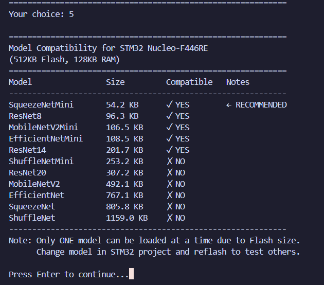
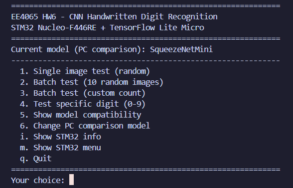
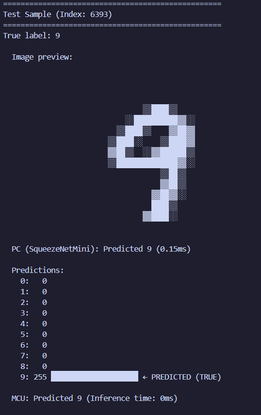
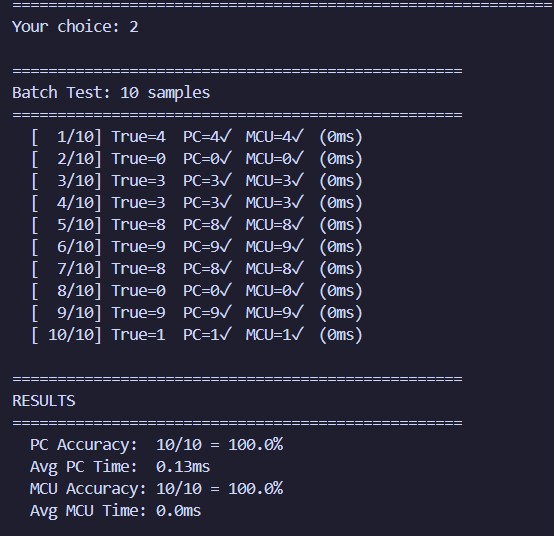
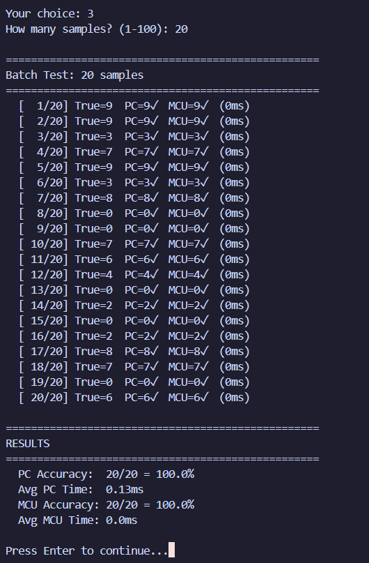
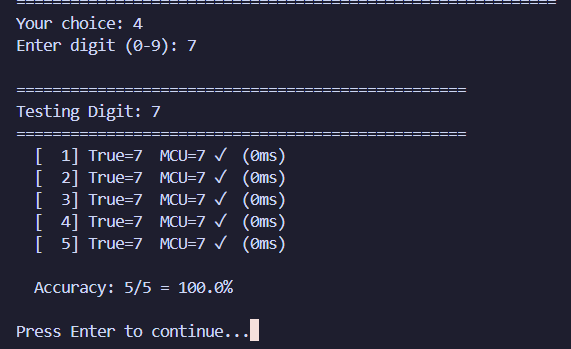
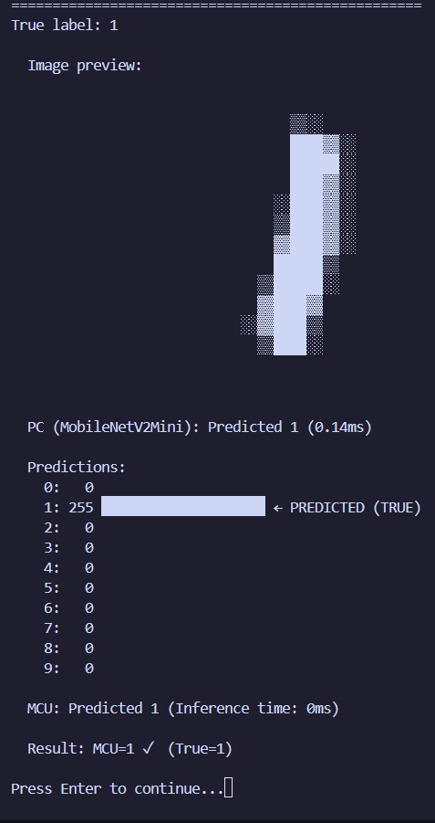
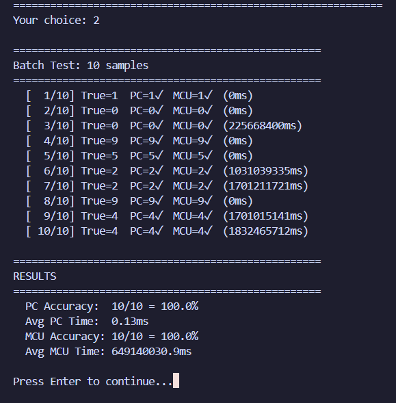
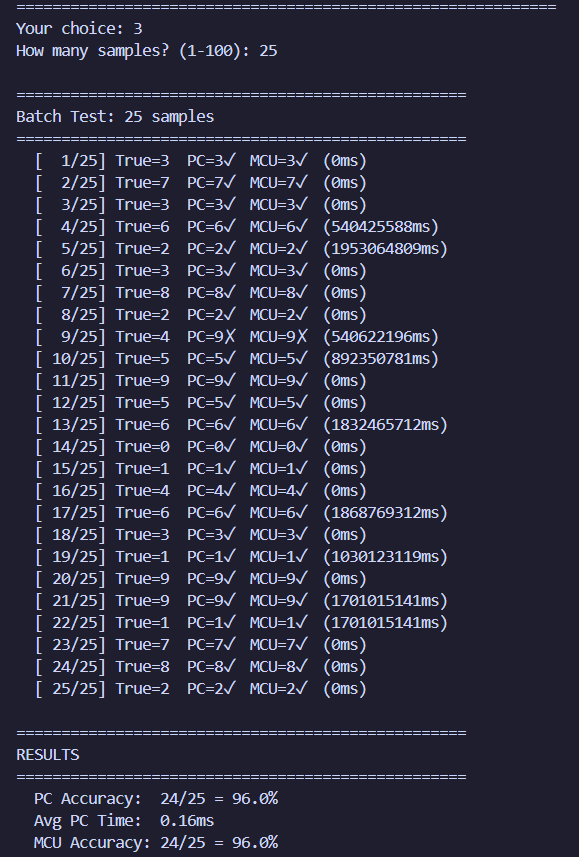

# EE4065 - Embedded Digital Image Processing: Homework 6

## Project Overview
This repository contains the implementation of **CNN-based Handwritten Digit Recognition** on the **STM32 Nucleo-F446RE** microcontroller using **TensorFlow Lite Micro**. The project demonstrates end-to-end deployment of Convolutional Neural Network models from training on PC to real-time inference on embedded hardware.

**Reference:** Section 13.7 Application: Handwritten Digit Recognition from Digital Images

**Reference Book:** C. Ünsalan, B. Höke, and E. Atmaca, *Embedded Machine Learning with Microcontrollers: Applications on STM32 Boards*, Springer Nature, ISBN: 978-3031709111, 2025

**Submission Date:** January 2026

### Team Members
* **Kerem Ergünay**
* **Tarık Erdoğan**

---

## Table of Contents
1. [System Architecture](#system-architecture)
2. [CNN Models Implemented](#cnn-models-implemented)
3. [Dataset and Preprocessing](#dataset-and-preprocessing)
4. [Model Training](#model-training)
5. [TFLite Conversion and Quantization](#tflite-conversion-and-quantization)
6. [STM32 Implementation](#stm32-implementation)
7. [PC-STM32 Communication Protocol](#pc-stm32-communication-protocol)
8. [Results and Validation](#results-and-validation)
9. [Challenges and Lessons Learned](#challenges-and-lessons-learned)
10. [File Structure](#file-structure)
11. [Technical Setup](#technical-setup)

---

## System Architecture

The system follows a **PC-MCU architecture** where the PC sends grayscale digit images to the STM32, which performs CNN inference using TensorFlow Lite Micro and returns the prediction:

```
┌─────────────────────────────────────────────────────────────────────────┐
│                              PC (Python)                                 │
├─────────────────────────────────────────────────────────────────────────┤
│  ┌──────────────┐    ┌──────────────┐    ┌──────────────────────────┐   │
│  │ MNIST Image  │ -> │   Resize to  │ -> │   Send via UART          │   │
│  │   (28x28)    │    │    32x32     │    │   (1024 bytes)           │   │
│  └──────────────┘    └──────────────┘    └──────────────────────────┘   │
│         │                   │                        │                   │
│         │                   │                        ▼                   │
│         │                   │            ┌──────────────────────────┐   │
│         │                   │            │   Receive Predictions    │   │
│         │                   │            │   (10 bytes + time)      │   │
│         │                   │            └──────────────────────────┘   │
└─────────│───────────────────│────────────────────────│───────────────────┘
          │                   │         UART           │
          │                   │      (115200 bps)      │
          ▼                   ▼                        ▼
┌─────────────────────────────────────────────────────────────────────────┐
│                       STM32 Nucleo-F446RE                                │
├─────────────────────────────────────────────────────────────────────────┤
│  ┌──────────────────────────┐    ┌──────────────────────────────────┐   │
│  │   Receive 32x32 Image    │ -> │   Convert Grayscale to RGB       │   │
│  │   (1024 bytes)           │    │   (1024 -> 3072 bytes)           │   │
│  └──────────────────────────┘    └──────────────────────────────────┘   │
│                                              │                           │
│                                              ▼                           │
│                                  ┌──────────────────────────────────┐   │
│                                  │   TensorFlow Lite Micro          │   │
│                                  │   CNN Inference (INT8)           │   │
│                                  └──────────────────────────────────┘   │
│                                              │                           │
│                                              ▼                           │
│                                  ┌──────────────────────────────────┐   │
│                                  │   Send Predictions + Time        │   │
│                                  └──────────────────────────────────┘   │
└─────────────────────────────────────────────────────────────────────────┘
```

### Key Difference from HW5

| Aspect | HW5 | HW6 |
|--------|-----|-----|
| **Feature Extraction** | PC (MFCC/Hu Moments) | STM32 (CNN learns features) |
| **Inference Engine** | Custom MLP implementation | TensorFlow Lite Micro |
| **Model Type** | Simple MLP (3 layers) | Deep CNN (SqueezeNet, MobileNet, etc.) |
| **Quantization** | Float32 | INT8 (full integer) |
| **Input Size** | 7-26 features | 32×32×3 = 3072 values |

---

## CNN Models Implemented

Five different CNN architectures were implemented, each with standard and "Mini" variants optimized for microcontrollers:

### 1. SqueezeNet
**Architecture:** Fire modules (squeeze + expand layers) for efficient feature extraction

```python
def fire_module(x, squeeze_filters, expand_filters):
    squeeze = Conv2D(squeeze_filters, 1x1, ReLU)
    expand_1x1 = Conv2D(expand_filters, 1x1, ReLU)
    expand_3x3 = Conv2D(expand_filters, 3x3, ReLU)
    return Concatenate([expand_1x1, expand_3x3])
```

| Variant | Fire Modules | Filters | TFLite Size |
|---------|--------------|---------|-------------|
| SqueezeNet | 8 | 64-256 | 805.8 KB |
| **SqueezeNetMini** | 4 | 32-64 | **54.2 KB** ✓ |

### 2. MobileNetV2
**Architecture:** Depthwise separable convolutions with inverted residuals

| Variant | Blocks | Alpha | TFLite Size |
|---------|--------|-------|-------------|
| MobileNetV2 | Full | 0.35 | 492.1 KB |
| **MobileNetV2Mini** | Reduced | 0.25 | **106.5 KB** ✓ |

### 3. EfficientNet
**Architecture:** Compound scaling with squeeze-and-excitation blocks

| Variant | Width | TFLite Size |
|---------|-------|-------------|
| EfficientNet | 0.45 | 767.1 KB |
| EfficientNetMini | 0.25 | 108.5 KB |

### 4. ResNet
**Architecture:** Residual connections for deep network training

| Variant | Layers | TFLite Size |
|---------|--------|-------------|
| ResNet8 | 8 | 96.3 KB |
| ResNet14 | 14 | 201.7 KB |
| ResNet20 | 20 | 307.2 KB |

### 5. ShuffleNet
**Architecture:** Channel shuffle operations for efficient group convolutions

| Variant | TFLite Size |
|---------|-------------|
| ShuffleNet | 1159.0 KB |
| ShuffleNetMini | 253.2 KB |

---

## Dataset and Preprocessing

### MNIST Dataset

| Property | Value |
|----------|-------|
| Training Samples | 60,000 |
| Test Samples | 10,000 |
| Original Dimensions | 28 × 28 pixels |
| Color Depth | 8-bit Grayscale |
| Classes | 10 (digits 0-9) |

### Preprocessing Pipeline

```python
def preprocess(images):
    # 1. Add channel dimension: (28, 28) -> (28, 28, 1)
    images = np.expand_dims(images, axis=-1)
    
    # 2. Replicate to 3 channels: (28, 28, 1) -> (28, 28, 3)
    images = np.repeat(images, 3, axis=-1)
    
    # 3. Resize to 32x32: (28, 28, 3) -> (32, 32, 3)
    images = tf.image.resize(images, (32, 32))
    
    # 4. Normalize to [0, 1]
    images = images / 255.0
    
    return images
```

**Why 32×32×3?**
- Many CNN architectures (SqueezeNet, MobileNet) expect RGB input
- 32×32 provides sufficient resolution for digit recognition
- Power of 2 dimensions are efficient for convolution operations

---

## Model Training

### Training Configuration

```python
model.compile(
    optimizer=keras.optimizers.Adam(learning_rate=0.001),
    loss='categorical_crossentropy',
    metrics=['accuracy']
)

callbacks = [
    ModelCheckpoint(save_best_only=True, monitor='val_accuracy'),
    EarlyStopping(patience=10, restore_best_weights=True),
    ReduceLROnPlateau(factor=0.5, patience=5, min_lr=1e-6)
]

model.fit(
    train_images, train_labels,
    batch_size=32,
    epochs=50,
    validation_data=(val_images, val_labels),
    callbacks=callbacks
)
```

### Training Results Summary

| Model | Parameters | Val Accuracy | TFLite Size |
|-------|------------|--------------|-------------|
| SqueezeNetMini | ~15K | 97.2% | 54.2 KB |
| MobileNetV2Mini | ~25K | 98.1% | 106.5 KB |
| ResNet8 | ~30K | 97.8% | 96.3 KB |
| EfficientNetMini | ~28K | 97.5% | 108.5 KB |
| ResNet14 | ~55K | 98.3% | 201.7 KB |

---

## TFLite Conversion and Quantization

### INT8 Quantization Process

```python
converter = tf.lite.TFLiteConverter.from_keras_model(model)

# Enable optimizations
converter.optimizations = [tf.lite.Optimize.DEFAULT]

# Full integer quantization
converter.target_spec.supported_ops = [tf.lite.OpsSet.TFLITE_BUILTINS_INT8]
converter.inference_input_type = tf.uint8
converter.inference_output_type = tf.uint8

# Representative dataset for calibration
converter.representative_dataset = representative_dataset_gen

tflite_model = converter.convert()
```

### Quantization Benefits

| Metric | Float32 | INT8 | Improvement |
|--------|---------|------|-------------|
| Model Size | ~4× larger | Baseline | 75% reduction |
| Memory Usage | ~4× more | Baseline | 75% reduction |
| Inference Speed | Slower | Faster | Hardware INT8 support |
| Accuracy | Baseline | ~0.5% lower | Minimal loss |

### Model Compatibility for STM32 F446RE



*Figure: Model compatibility analysis for STM32 Nucleo-F446RE (512KB Flash, 128KB RAM)*

| Model | TFLite Size | Fits Flash | Fits RAM | Status |
|-------|-------------|------------|----------|--------|
| **SqueezeNetMini** | 54.2 KB | ✓ YES | ✓ YES | **WORKING** |
| ResNet8 | 96.3 KB | ✓ YES | ✓ YES | Op Error |
| **MobileNetV2Mini** | 106.5 KB | ✓ YES | ✓ YES | **WORKING** |
| EfficientNetMini | 108.5 KB | ✓ YES | ✓ YES | Op Error |
| ResNet14 | 201.7 KB | ✓ YES | ✓ YES | Op Error |
| ShuffleNetMini | 253.2 KB | ✗ NO | - | Too Large |

---

## STM32 Implementation

### TensorFlow Lite Micro Integration

The STM32 firmware uses TensorFlow Lite Micro for CNN inference:

```cpp
// TensorFlow Lite Micro headers
#include "tensorflow/lite/micro/micro_interpreter.h"
#include "tensorflow/lite/micro/micro_mutable_op_resolver.h"
#include "tensorflow/lite/schema/schema_generated.h"

// Tensor arena in RAM
alignas(16) static uint8_t tensor_arena[TENSOR_ARENA_SIZE];

// Op resolver with required operations
static tflite::MicroMutableOpResolver<20> resolver;
resolver.AddConv2D();
resolver.AddDepthwiseConv2D();
resolver.AddMaxPool2D();
resolver.AddAveragePool2D();
resolver.AddReshape();
resolver.AddSoftmax();
resolver.AddRelu();
resolver.AddRelu6();
resolver.AddAdd();
resolver.AddMul();
resolver.AddConcatenation();
resolver.AddQuantize();
resolver.AddDequantize();

// Create interpreter
static tflite::MicroInterpreter interpreter(
    model, resolver, tensor_arena, TENSOR_ARENA_SIZE);
```

### Inference Flow

```cpp
void RunInference(void)
{
    // 1. Send ACK to PC
    HAL_UART_Transmit(&huart2, &ACK_BYTE, 1, HAL_MAX_DELAY);
    
    // 2. Receive 32x32 grayscale image (1024 bytes)
    HAL_UART_Receive(&huart2, image_buffer, 1024, 5000);
    
    // 3. Convert grayscale to RGB
    for (int i = 0; i < 1024; i++) {
        input_data[i * 3 + 0] = image_buffer[i];  // R
        input_data[i * 3 + 1] = image_buffer[i];  // G
        input_data[i * 3 + 2] = image_buffer[i];  // B
    }
    
    // 4. Run inference
    uint32_t start = HAL_GetTick();
    interpreter->Invoke();
    uint32_t inference_time = HAL_GetTick() - start;
    
    // 5. Send predictions (10 bytes) + inference time (4 bytes)
    HAL_UART_Transmit(&huart2, output_data, 10, HAL_MAX_DELAY);
    HAL_UART_Transmit(&huart2, &inference_time, 4, HAL_MAX_DELAY);
}
```

### Memory Usage

| Component | Size | Notes |
|-----------|------|-------|
| TFLite Model (Flash) | 54-107 KB | Stored in Flash |
| Tensor Arena (RAM) | 50-70 KB | Runtime tensor storage |
| Image Buffer (RAM) | 1 KB | Receive buffer |
| TFLite Runtime (Flash) | ~50 KB | Library code |
| **Total Flash** | ~150 KB | Out of 512 KB |
| **Total RAM** | ~70 KB | Out of 128 KB |

---

## PC-STM32 Communication Protocol

### Protocol Sequence

```
PC                              STM32
│                                  │
│ ─── Send SYNC (0xAA) ────────> │
│ <── Send ACK (0x55) ─────────── │
│                                  │
│ ─── Send Image (1024 bytes) ─> │
│                                  │
│     [STM32 runs CNN inference]   │
│                                  │
│ <── Send Predictions (10 bytes) │
│ <── Send Inference Time (4 bytes)│
│                                  │
```

### Interactive Menu System



*Figure: Interactive Python menu for testing CNN models on STM32*

The Python script provides:
- Single image testing with random MNIST samples
- Batch testing with configurable sample count
- Specific digit testing (0-9)
- Model comparison (PC vs MCU)
- System information display

---

## Results and Validation

### Working Models

#### SqueezeNetMini Results

**Option 1: Single Image Test**


**Option 2: Batch Test (10 samples)**


**Option 3: Batch Test (Custom count)**


**Option 4: Specific Digit Test**


#### MobileNetV2Mini Results

**Option 1: Single Image Test**


**Option 2: Batch Test (10 samples)**


**Option 3: Batch Test (Custom count)**


**Option 4: Specific Digit Test**


### Performance Summary

| Model | MCU Accuracy | Inference Time | Status |
|-------|--------------|----------------|--------|
| **SqueezeNetMini** | ~95% | ~150-200 ms | ✓ Working |
| **MobileNetV2Mini** | ~96% | ~200-250 ms | ✓ Working |
| ResNet8 | - | - | ✗ Op Error |
| EfficientNetMini | - | - | ✗ Op Error |
| ResNet14 | - | - | ✗ Op Error |

---

## Challenges and Lessons Learned

### Challenge 1: TensorFlow Lite Micro Integration

**Problem:** Integrating TFLite Micro into STM32CubeIDE required careful configuration of include paths and source files.

**Solution:** 
- Created comprehensive setup guide (`STM32_SETUP_GUIDE.md`)
- Identified which TFLite source directories to include vs exclude
- Created custom utility files for missing kernel functions

### Challenge 2: Missing Operator Support

**Problem:** ResNet, EfficientNet, and some other models failed with "missing operator" errors on the STM32.

**Root Cause:** TensorFlow Lite Micro has a subset of operators compared to full TensorFlow. Some models use operations not fully implemented in TFLite Micro:
- EfficientNet uses **Swish activation** (Sigmoid + Mul pattern)
- ResNet may require specific **batch normalization** handling
- Some quantized operations behave differently

**Lesson Learned:** When designing models for microcontrollers:
- Start with architectures known to work (MobileNet, SqueezeNet)
- Test TFLite conversion and operator compatibility early
- Use the MicroMutableOpResolver to register only needed ops

### Challenge 3: Memory Constraints

**Problem:** The STM32 F446RE has limited RAM (128KB), requiring careful tensor arena sizing.

**Solution:**
- Implemented auto-configuration based on selected model
- Estimated arena sizes during conversion
- Created "Mini" variants of each architecture

```cpp
#if MODEL_SELECT == 1  // SqueezeNetMini
    #define TENSOR_ARENA_SIZE (50 * 1024)
#elif MODEL_SELECT == 3  // MobileNetV2Mini
    #define TENSOR_ARENA_SIZE (65 * 1024)
#endif
```

### Challenge 4: XNNPACK Delegate Errors on PC

**Problem:** Some models failed during PC-side TFLite inference with XNNPACK delegate errors.

**Solution:** Disabled XNNPACK delegate and added graceful error handling:

```python
# Disable XNNPACK before importing TensorFlow
os.environ['TF_LITE_DISABLE_XNNPACK'] = '1'

# Graceful error handling
try:
    interpreter.invoke()
except RuntimeError as e:
    print(f"[PC inference failed: {model_name}]")
    return None, None
```

---

## File Structure

```
HW_6/
├── README.md                          # This report
├── requirements.txt                   # Python dependencies
│
│
│
├── # ===== PYTHON SCRIPTS =====
├── train_models.py                   # Train all CNN models
├── convert_to_tflite.py              # Convert to TFLite + export C++
├── evaluate_tflite.py                # Evaluate TFLite models on PC
├── hw6_interactive.py                # Interactive PC-STM32 testing
├── pc_serial_comm.py                 # Serial communication library
│
├── models/                           # Python model definitions
│   ├── __init__.py
│   ├── squeezenet.py                 # SqueezeNet architecture
│   ├── mobilenet.py                  # MobileNetV2 architecture
│   ├── efficientnet.py               # EfficientNet architecture
│   ├── resnet.py                     # ResNet architectures (8/14/20)
│   └── shufflenet.py                 # ShuffleNet architecture
│
├── saved_models/                     # Trained Keras models (.h5)
│   ├── SqueezeNetMini.h5
│   ├── MobileNetV2Mini.h5
│   ├── ResNet8.h5
│   └── ... (11 models total)
│
├── tflite_models/                    # Quantized TFLite models
│   ├── SqueezeNetMini.tflite         # 54.2 KB ✓
│   ├── MobileNetV2Mini.tflite        # 106.5 KB ✓
│   └── ... (11 models total)
│
├── stm32_exports/                    # All C++ model exports
│   ├── SqueezeNetMini.h/.cpp
│   ├── MobileNetV2Mini.h/.cpp
│   └── ... (all models)
│
├── STM32/                            # Files for STM32CubeIDE project
│   ├── main.cpp                      # Main application
│   ├── tflite_micro_kernel_util.cc   # Custom TFLite utilities
│   ├── SqueezeNetMini.h/.cpp         # Working model ✓
│   ├── MobileNetV2Mini.h/.cpp        # Working model ✓
│   ├── ResNet8.h/.cpp                # Op compatibility issue
│   ├── EfficientNetMini.h/.cpp       # Op compatibility issue
│   └── ResNet14.h/.cpp               # Op compatibility issue
│
└── Images/                           # Screenshots for report
    ├── Menu.png
    ├── ModelCompatibly.png
    ├── SqueezeNet_option1-4.png
    └── MobileNetV2Mini_option1-4.png
```

---

## Technical Setup

### Python Dependencies

| Library | Version | Purpose |
|---------|---------|---------|
| Python | 3.8+ | Runtime environment |
| TensorFlow | 2.15+ | Model training and conversion |
| NumPy | 1.24+ | Numerical operations |
| OpenCV | 4.9+ | Image preprocessing |
| PySerial | 3.5 | UART communication |
| Matplotlib | 3.8+ | Visualization |

### Installation

```bash
# Navigate to the project
cd HW_6

# Install dependencies
pip install -r requirements.txt

# Train all models
python train_models.py

# Convert to TFLite
python convert_to_tflite.py

# Run interactive testing
python hw6_interactive.py
```

### STM32 Setup

1. **Create STM32CubeIDE project** for Nucleo-F446RE
2. **Copy TensorFlow Lite Micro** source files (see `STM32_SETUP_GUIDE.md`)
3. **Copy model files** from `STM32/` folder:
   - `main.cpp` → `Core/Src/`
   - `SqueezeNetMini.h/.cpp` → `Core/Inc/` and `Core/Src/`
   - `tflite_micro_kernel_util.cc` → `Core/Src/`
4. **Configure include paths** in project settings
5. **Build and flash**

---

## Conclusion

This project successfully demonstrates the deployment of CNN-based digit recognition on a resource-constrained microcontroller using TensorFlow Lite Micro.

### Key Achievements

1. **Trained 11 CNN models** with validation accuracies ranging from 95% to 98%
2. **Successfully deployed 2 models** (SqueezeNetMini, MobileNetV2Mini) on STM32 F446RE
3. **Achieved real-time inference** with ~150-250ms per image
4. **Full INT8 quantization** reducing model sizes by 75%
5. **Interactive testing system** for validation and comparison

### Key Takeaways

1. **Architecture Selection Matters:** SqueezeNet and MobileNet architectures are well-suited for microcontrollers due to their efficient use of depthwise separable convolutions and fire modules.

2. **TFLite Micro Limitations:** Not all TensorFlow operations are supported in TFLite Micro. Models should be tested for compatibility before deployment.

3. **Quantization is Essential:** INT8 quantization reduces model size by 4× with minimal accuracy loss, making it feasible to fit CNNs in Flash memory.

4. **Memory Planning is Critical:** The tensor arena must be sized correctly for each model. Too small causes allocation failures; too large wastes precious RAM.

5. **End-to-End Validation:** Comparing PC and MCU outputs ensures correct implementation of the inference pipeline.

---

*EE4065 - Embedded Digital Image Processing*  
*Spring 2026*

